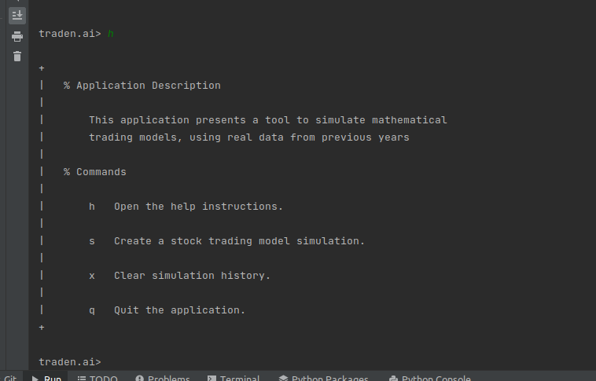
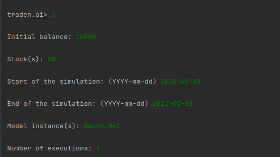
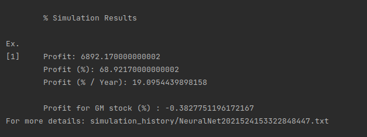
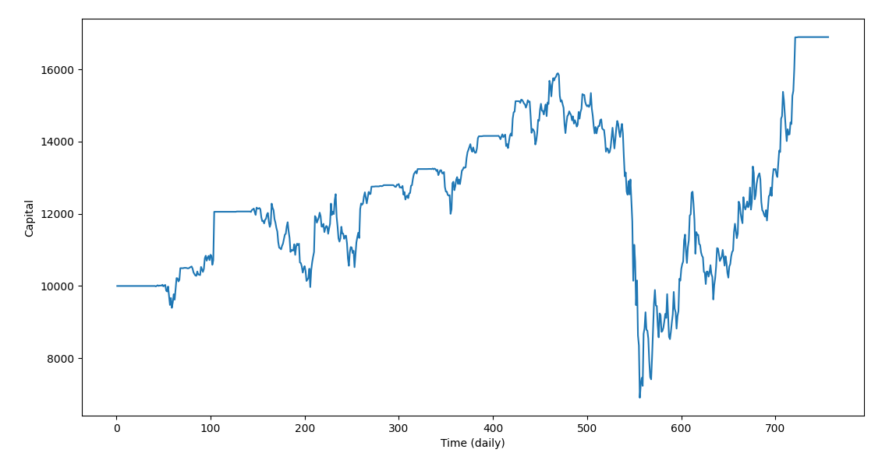
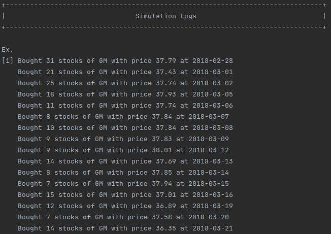

<h1 align="center">traden.ai</h1>

  

  <a href="#about">About</a> •
  <a href="#technologies">Technologies</a> •
  <a href="#installation">Installation</a> •
  <a href="#run">Run</a> •
  <a href="#demo">Demo</a> •
  <a href="#contributing">Contributing</a>
  

# About
 

Our plataform allows users to create different models for stock trading, namely the creation of arbitrary tecniques to buy or sell a stock derived from a given understanding of the behavior of the stock's price. 
 
 
After the creation of models, the user can see how the model would perform for a given period time, and for a given number of specified stocks. 
 

In the traden ecosystem you can also find some very interesting mechanisms to combine different models, which then can be tested using backtesting techniques.  

# Technologies

* Require download
  * [Python3](https://www.python.org/)
  * [TensorFlow](https://www.tensorflow.org/)
  * [Keras](https://keras.io/)
  * [Scikit-Learn](https://scikit-learn.org/stable/)
* No download required
  * [Amazon Web Services](https://aws.amazon.com/)

# Installation

1. Clone the repository into your local computer
2. Install Python3
3. Install Python Libraries
     
    3.1 Boto3 (pip3 install boto3)
     
    3.2 TensorFlow (pip3 install tensorflow)
     
    3.3 Keras (pip3 install keras)
     
    3.4 Json Encoder (pip3 install json-encoder)
     
    3.5 Scikit-Learn (pip3 install scikit-learn)
     
 

4. (Optional) Set the PYTHONPATH environment variable to the StockTradingSimulator directory in the source file of your operating system (for example bashrc in some linux operating systems)

Note: You can use the commands in parentheses, to install the respetive dependencies in the command line (assuming you have pip3 installed).

# Run

1. Set the PYTHONPATH environment variable to the StockTradingSimulator directory
2. Run the app file using a python interpreter

Note: We recommend the use of IDE such as [PyCharm](https://www.jetbrains.com/pycharm/) with running features already integrated which automatically set the environment variables.

# Demo

This is a demo for a model simulation:

1. Starting the app

2. Selecting a Simulation

3. Seeing the Results

4. Extra Details
     
    4.1 Graph

    

    4.2 Simulation History
    
    

# Contributing

Your contributions are always welcome! Please have a look at the contribution guidelines first.
